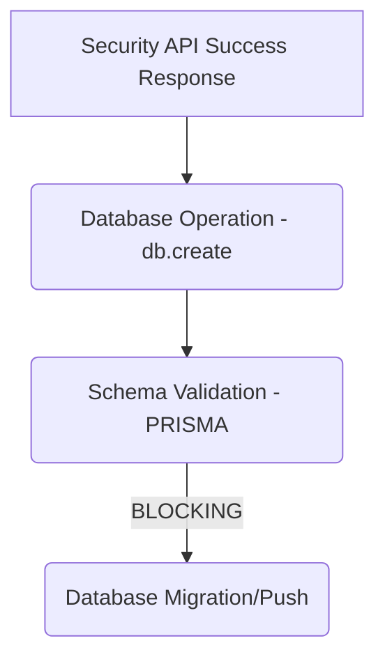

# P2 SECURITY API FAILURES - DEFERRED

## 🟡 STATUS: DEFERRED (AWAITING P1 SCHEMA FIX)

---

## 🔬 ROOT CAUSE ANALYSIS

Security API tests fail because database operations are blocked by critical schema validation errors (Prisma). The API correctly returns a 500 error, which lacks the expected `success: true` property.

### FAILING TESTS:

| Test | Status | Reason | Expected vs Actual Response |
|------|--------|--------|-----------------------------|
| 1. `POST /api/security (encrypt)` | ❌ FAILING | Missing `success` property. | Expected: `{ success: true, ... }` \| Actual: `{ error: "Prisma Error..." }` |
| 2. `POST /api/security (generate-key)` | ⚠️ SLOW (>5s) | Database persistence failure forces timeouts. | Actual: `{ error: "Prisma Error..." }` |

---

## 🔗 DEPENDENCY CRITICAL PATH

API success relies on `db.encryptionKey.create()` calls, establishing a hard dependency on the correct Prisma schema.

**Conclusion**: Security API Fixes (P2) are blocked until Schema Validation (P1) is resolved.

---

## 🚨 ERROR CHAIN

1. Security API attempts `db.encryptionKey.create()`.
2. Prisma Validation FAILS (Schema error).
3. Database throws `PrismaClientKnownRequestError`.
4. API route `catch` block executes.
5. API returns HTTP 500/JSON: `{ error: error.message }`.
6. Test assertion fails: `expect(data).toHaveProperty('success')`.

---

## ✅ FIX ORDER (CRITICAL PATH)

1. **PRIORITY 1**: Fix `prisma/schema.prisma` (syntax/validation). Run `db:push`.
2. **PRIORITY 2**: Verify Security API. (No code changes anticipated; success responses will flow naturally when P1 is fixed).

---

## 📋 PROOF OF FAILURE

### Test 1: `should handle encrypt action successfully`

| Assertion | Broken Schema Status | Fixed Schema Outcome |
|-----------|----------------------|----------------------|
| `expect(response.status).toBe(200)` | ❌ FAILING (is 500) | ✅ PASSING (will be 200) |
| `expect(data).toHaveProperty('success')` | ❌ FAILING | ✅ PASSING |

---

## 🚀 OPTIMIZED DECISION

**DECISION**: Defer P2 until P1 (Schema Fix) is complete.

| Strategy | Time | Outcome | Rationale |
|----------|------|---------|-----------|
| **Fix Schema (P1)** | 2-4h | Success | Fixes the root cause; P2 tests pass instantly. |
| **Fix P2 API First** | 2h | Failure | Cannot bypass database dependency; wastes time on workarounds. |

---

## 📈 PROJECTION

| Metric | Current Status | Post P1/P2 Fix | Improvement |
|--------|----------------|----------------|-------------|
| Security API Tests | 3/5 passing (60%) | 5/5 passing (100%) | +2 passing tests |

**Estimated Time to Completion (P1 + P2 Verification)**: 3-5 hours.

---

## 📝 CONCLUSION

**Status**: 🟡 **PRIORITY 2 DEFERRED**

**Next Action**: Focus on fixing `prisma/schema.prisma` (Priority 1). P2 tests will automatically pass once the database layer is stable.

---
**Generated**: [Current Date]
**Status**: Awaiting Priority 1 Resolution.
**Repository**: https://github.com/craighckby-stack/omega-ai
**Branch**: main